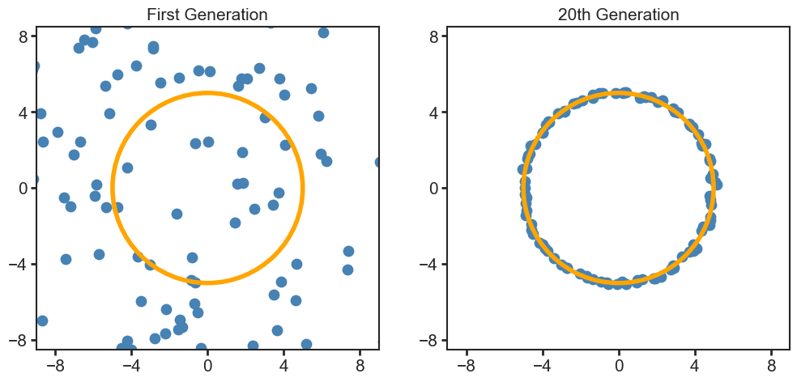

# README.md

## Lightweight Genetic Algorithm

This package provides an intuitive, flexible, and efficient implementation of a genetic algorithm in Python. It is designed to be easy to use while still providing a high degree of flexibility for a wide range of optimization problems. The package is developed by Eliel Camargo-Molina and Jonas Wessén.

The genetic algorithm implemented in this package includes features such as multiple crossover methods, mutation modes, support for both numerical and categorical genes, and a unique diversity calculation that makes it effective even for small populations and few generations.

In the context of this genetic algorithm, a "gene" can be understood as a parameter or variable that we want to optimize. It can be numeric when we explore the parameter space of a model or theory or categorical when we express discrete, non-numeric options, for example, the types of subunits in a macromolecule.

### Installation

You can install the package using pip:

```bash
pip install lightweight-genetic-algorithm
```

### Usage

The primary class in this package is `GeneticAlgorithm`. Here's an example of how you use it:

```python
# Define the center and radius of a circle
center = np.array([0.0, 0.0])
radius = 5.0

# Define your fitness function
def fitness_function(individual):
    distance = np.linalg.norm(individual - center)
    fitness = -abs(distance - radius)**2
    return fitness

# Define the range of your genes
gene_ranges = [(-10, 10), (-10, 10)]

# Create a GeneticAlgorithm instance
ga = GeneticAlgorithm(fitness_function, 
                      gene_ranges, 
                      crossover_method="Between",
                      number_of_genes=2, 
                      mutation_mode=["Additive", "Multiplicative"], 
                      mutation_rate=0.1)

# Run the genetic algorithm
population = ga.run(n_generations=20, population_size=100)

# Plot the final population
plt.figure(figsize=(6, 6))
plt.scatter(population[:, 0], population[:, 1], color='blue')
circle1 = plt.Circle(center1, radius1, fill=False, color='red')
plt.gca().add_artist(circle1)
plt.gca().set_aspect('equal', adjustable='box')
plt.show()
```



In this example, we're using the genetic algorithm to approximate a circular shape based on a defined radial fitness function. The genes for the `GeneticAlgorithm` class can be adjusted to fit the needs of your specific problem, including both numerical and categorical genes.

Here's another example using categorical genes:

```python
from lightweight_genetic_algorithm import GeneticAlgorithm

# Define your fitness function
def fitness_function(individual):
    abs_total_charge = abs(sum(individual))
    return abs_total_charge

# Define the range of your genes
# Because it is a one-dimensional list 
# categorical genes are automatically recognized
# gene_ranges is then the list of categories
gene_ranges = [1,-1]

# Create a GeneticAlgorithm instance
ga = GeneticAlgorithm(fitness_function, 
                      gene_ranges, 
                      crossover_method="Either Or",
                      number_of_genes=50,  
                      mutation_rate=0.1)

# Run the genetic algorithm
population = ga.run(n_generations=10, population_size=1000)
```
In this example, we're trying to optimize an array of +1 and -1 so that the absolute value of the total charge is maximized. For categorical genes, the "Either Or" crossover method is used, which is the only method compatible with categorical genes in the current implementation.

### Inputs

The `GeneticAlgorithm` class accepts the following inputs:

- `fitness_function`: A function computing the fitness score of an individual. This function should receive an array of genes as input and return a single number.

- `gene_ranges`: A list of tuples representing the range of each numeric gene. Each tuple should contain two numbers, with the first number being the lower bound and the second the upper bound. For categorical genes, it should be a one-dimensional list of possible categories.

- `number_of_genes` (optional): The number of genes, needed when the genes are categorical. For numeric genes, the default is the length of `gene_ranges`.

- `crossover_method` (optional): The method used for crossover. Available options are "Between", "Midpoint", "Either Or", and "None". For categorical genes, "Either Or" must be used. Default is "Between".

- `mutation_mode` (optional): The mode used for mutation. Options available are "additive", "multiplicative", "random", and "categorical". Default is "additive" for numeric genes and "categorical" for categorical genes.

- `mutation_rate` (optional): The rate of mutation. The default is 1.0/number_of_genes.

- `measure` (optional): A function to measure the distance between two points in the gene space. The default is Euclidean distance. This function is ignored for categorical genes.

### Crossover Methods

The package provides four different crossover methods:

- **Between**: In this method, the child's genes are chosen to be a random value between the corresponding genes of the two parents. This method is suitable for numeric genes.

- **Midpoint**: In this method, the child's genes are chosen to be the average of the corresponding genes of the two parents. This method is also suitable for numeric genes.

- **Either Or**: In this method, the child's genes are chosen to be either the corresponding gene of the first parent or the second parent. This method is suitable for both numeric and categorical genes. However, for categorical genes, this is the only method that should be used.

- **None**: No crossover is performed. This method can be used when you want to run the genetic algorithm without any crossover.

### Diversity Calculation

The diversity calculation is a measure of how different two individuals are from each other, based on their gene values. The package includes a unique diversity calculation that makes the algorithm effective even for small populations and few generations. This calculation is based on the Euclidean distance between individuals and is designed to promote diversity within the population.

The diversity score is calculated using the following steps:

1. The Euclidean distance between the gene values of two individuals is calculated. For categorical genes, the Hamming distance (the number of positions at which the corresponding genes are different) is used instead.

2. The distance is then normalized by a diversity constant, which is inversely proportional to the population size. This ensures that the diversity score is adjusted based on the size of the total population.

3. The normalized distance is then transformed using an exponential function to ensure that the diversity score is always between 0 and 1.

The package also allows you to supply your own function to measure the distance between two points in the gene space. This allows you to customize the diversity calculation to better match your problem. Note that this feature does not apply when working with categorical genes.

### Features

- **Multiple Crossover Methods**: The package provides four different crossover methods: "Between", "Midpoint", "Either Or", and "None". For categorical genes, "Either Or" must be used. For numeric genes, you can select the one that best matches your problem.

- **Multiple Mutation Modes**: The package includes four mutation modes: "additive", "multiplicative", "random", and "categorical". This flexibility allows you to choose the mutation mode that best suits your problem, whether it uses numeric or categorical genes.

- **Diversity Calculation**: The package contains a unique diversity calculation which makes the algorithm effective even for small populations and a few generations. This calculation is based on the Euclidean distance between individuals, and it is designed to promote diversity within the population. The diversity score is a measure of how different two individuals are from each other, based on their gene values. The class also includes a method to adjust the diversity calculation based on the size of the total population.

- **Support for Numerical and Categorical Genes**: The GeneticAlgorithm class can handle both numeric and categorical genes, which enables users to solve a wider range of optimization problems.

- **Customizable Measure Function**: The package allows you to supply your own function to measure the distance between two points in the gene space. This flexibility lets you customize the diversity calculation to better match your problem. Note that this feature does not apply when working with categorical genes.